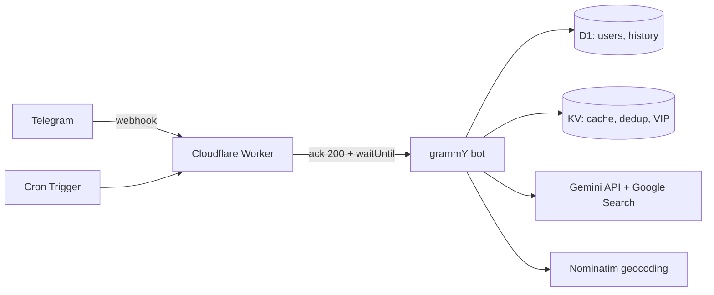

# 🎬 CineMind

**AI-кинокритик в Telegram.** Бот изучает твои вкусы и подбирает фильмы и сериалы —
новинки в цифре, сеансы в кино рядом с тобой и будущие премьеры — с учётом профиля
и живого веб-поиска через Google Gemini.

Изначально проект жил в Google Apps Script (Google Sheets как база). Эта версия —
полный перенос на современный стек: **TypeScript + Cloudflare Workers + grammY + D1 + Gemini**.

---

## ✨ Возможности

- 🧠 **Профиль вкусов** — Gemini превращает свободное описание («люблю Нолана, ненавижу хорроры»)
  в структурированный профиль.
- 🍿 **`/cinema`** — что идёт в кино рядом (город через геокодинг).
- 🏠 **`/releases`** — свежие цифровые релизы под твой вкус.
- 🔮 **`/soon`** — будущие премьеры.
- 💬 **Свободный чат** — рекомендации с памятью диалога.
- 🔔 **Ежемесячный дайджест** — по cron-расписанию.
- 💎 **Лимиты и VIP** — дневной лимит для бесплатных, безлимит по членству в закрытом канале.
- 🌐 **Веб-поиск (grounding)** — Gemini ищет актуальные данные в реальном времени.

## 🏗 Архитектура



**Поток запроса:** Telegram шлёт апдейт на `/webhook` → Worker проверяет секретный
заголовок и мгновенно отвечает `200`, а тяжёлый вызов Gemini выполняется в фоне
(`ctx.waitUntil`), поэтому Telegram не ретраит долгие ответы.

| Слой | Технология |
|---|---|
| Runtime | Cloudflare Workers (TypeScript) |
| Telegram | [grammY](https://grammy.dev) |
| База данных | Cloudflare D1 (SQLite) + Drizzle ORM |
| Кэш / дедуп / VIP | Cloudflare KV |
| AI | Google Gemini (Flash + Pro, Google Search grounding) |
| Геокодинг | OpenStreetMap Nominatim |
| Расписание | Cloudflare Cron Triggers |
| Тесты / CI | Vitest + GitHub Actions |

## 📁 Структура

```
src/
  index.ts            # fetch (webhook) + scheduled (cron)
  bot.ts              # сборка grammY: middleware, роутинг
  context.ts          # тип контекста (env, db, log, user)
  config.ts           # команды, лимиты, состояния
  prompts.ts          # системные промпты Gemini
  keyboards.ts        # inline-меню
  db/                 # schema (Drizzle) + client + repository
  services/           # gemini, telegram (форматирование), geocoding
  handlers/           # onboarding, recommend, commands, admin, group, digest
  lib/                # logger (с алертами), vip
migrations/           # D1 SQL-миграции
scripts/              # import-from-sheet, set-webhook
test/                 # vitest
```

## 🚀 Запуск

### Требования
- Node.js 22+ и `pnpm`
- Аккаунт Cloudflare (`wrangler login`)
- Токен бота от [@BotFather](https://t.me/BotFather)
- API-ключ [Google AI Studio](https://aistudio.google.com/)

### Установка

```bash
pnpm install

# 1. Ресурсы Cloudflare — вставь полученные id в wrangler.toml
wrangler d1 create cinemind
wrangler kv namespace create CACHE

# 2. Применить схему БД
pnpm db:migrate:remote     # или :local для локали

# 3. Секреты (продакшен)
wrangler secret put TELEGRAM_TOKEN
wrangler secret put TELEGRAM_WEBHOOK_SECRET
wrangler secret put GEMINI_API_KEY
wrangler secret put VIP_CHAT_ID
wrangler secret put BOT_USERNAME
wrangler secret put PATREON_URL
wrangler secret put BOOSTY_URL

# 4. Деплой
pnpm deploy

# 5. Зарегистрировать webhook и меню команд
TELEGRAM_TOKEN=... TELEGRAM_WEBHOOK_SECRET=... \
WEBHOOK_URL=https://cinemind.<you>.workers.dev/webhook \
pnpm setup:webhook
```

### Локальная разработка

```bash
cp .dev.vars.example .dev.vars   # заполни значения
pnpm dev                          # wrangler dev
pnpm test                         # тесты
```

## 🔄 Миграция данных из Google Sheets

Старые пользователи переносятся одним скриптом:

```bash
# Таблица должна быть доступна "по ссылке"
SHEET_ID=<id> pnpm import:sheet
# Сгенерирует migrations/0001_data.sql (git-ignored, содержит PII)
wrangler d1 execute cinemind --remote --file=migrations/0001_data.sql
```

## 🔐 Безопасность

- Все секреты — в Wrangler secrets / `.dev.vars` (никогда не коммитятся).
- Webhook проверяется по заголовку `X-Telegram-Bot-Api-Secret-Token`.
- В логах токены и ключи маскируются.

## 📜 Лицензия

[MIT](LICENSE) © Timofey Matveev
